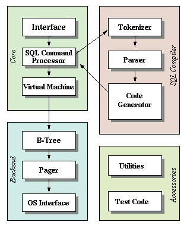
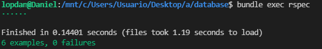

# Database

Database written in C, inspired in [SQLite](https://www.sqlite.org/index.html).



## How to run it

Compile the program and create the executable:
```
make
```
Run the database after creating the executable:
```
./database test.db
```
After running the program, you have availiable the insert and select commands:
```
./database test.db
Database > insert 1 test test@user.com
Executed.
Database > select
(1, test, test@user.com)
Executed.
Database > .exit
```

## Test coverage

* Insert and select commands.
* Max length value insert.
* Data persistence in database.
* Error when table is full.
* Error when max length value exceeded.
* Error when ID number is not positive


